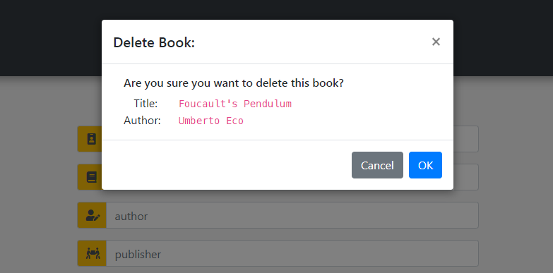

# PHP CRUD Bookstore

Combining PHP and JavaScript for a CRUD bookstore that allows you to administer book entries stored in a `json` file.

To make it easier for others to try this project, I decided to do away with the MySQL part and replaced it with a simple  `json` data structure. 

## Install

Once you have cloned or downloaded the repository, copy the **contents** of the `src` folder to your PHP server and open the `index-js.html` file in your browser via `localhost`.

If you're familiar with [Apache Ant](https://ant.apache.org/), there's `build` scripts available in the workspace root that you can adjust to your needs.

## The Project

The index page is not a `.php` page, but a plain `.html` page to ensure a clear separation (decoupling) between HTML/CSS/JS and PHP.

### HTML / CSS / JS

* Displays the data as well as provides a `form` to modify that data.
* Sends data to PHP scripts.
* Receives data from PHP scripts.

### PHP

* Handles the data.
* Acts as a go-between between JS and JSON storage.

### The Code

#### Javascript

At the very top of the `main.js` a few constants are defined, pointing to the location of the CRUD php scripts.

```javascript
// Constants for PHP CRUD script locations.
const BOOKS_CREATE_URL = "./php/books-create.php";
const BOOKS_READ_URL = "./php/books-read.php";
const BOOKS_UPDATE_URL = "./php/books-update.php";
const BOOKS_DELETE_URL = "./php/books-delete.php";
```

This serves two purposes:

* Avoid making spelling mistakes when being used.
* In case the back-end changes, you only need to modify them in one place.

When the DOM is loaded we first set up listeners for each form button:

```javascript
const btnCreate = document.body.querySelector('#btn-create');
btnCreate.addEventListener('click', createClickHandler);
```

With the buttons all set we now make sure the app itself is as we want it:

```javascript
// Make sure the form is empty.
clearForm();
// Get things going by putting the app in the 'create' state.
setButtonState(STATE_CREATE);
// Fetch initial data and display it.
getBooksAsync().then(showBooks);
```

* `clearForm();` is pretty self-explanatory.
* `setButtonState(STATE_CREATE);` this puts the `form` buttons in the `create` state, meaning the user can now add (create) a new book. 

    Even though you'd expect a CRUD (Create, Read, Update, Delete) application to have four states, we'll only be using two, namely: Create and Update. And all a certain state really does is show/hide a pair of buttons and change the header text from "Add Book" to "Update Book" and vice versa.
* `getBooksAsync().then(showBooks);` This is where things get interesting, because there's two function calls chained together, with the interesting part being that the second function call - `showBooks()` - is only executed when the first part - `getBooksAsync()` has finished at which point the returned value is handed over to the `showBooks` method. 

  Maybe this will help further clarify:

  * *Person A* goes to the library to fetch some books (`getBooksAsync`).
  * Some time later, *Person A* returns home with books.
  * *Person A* hands books over to *Person B* (`then`).
  * *Person B* does something with books (`showBooks`).

Let's take a closer look at both methods:

```javascript
async function getBooksAsync() {
    let response = await fetch(BOOKS_READ_URL);
    let books = await response.json();
    return books;
}
```

First thing to note is the `async` keyword in front of the function. This denotes an [asynchronous method](https://developer.mozilla.org/en-US/docs/Web/JavaScript/Reference/Statements/async_function) and allows for the `await` keyword to be used inside the function.

When data is received from the call to the php script, it is first decoded from `json` to `javascript` before it is being returned. By returning the data (`return books;`), the [Promise](https://developer.mozilla.org/en-US/docs/Web/JavaScript/Reference/Global_Objects/Promise) is resolved, which executes the `then()` statement. The `then()` statement has the `showBooks` function as argument, which is called with the `books` returned from `getBooksAsync` as parameter. Which is just a complicated way of saying:

> get books, then, show books

```javascript
function showBooks(books) {
    let tmp = document.body.querySelector('template[name="tmp-table-row"]');
    let tbody = document.body.querySelector('#tb-books');

    // remove existing books
    while (tbody.firstChild) {
        tbody.removeChild(tbody.firstChild);
    }

    books.forEach(book => {
        let clone = tmp.content.cloneNode(true);
        // 'edit' and 'delete' buttons for table row
        let btns = clone.querySelectorAll('button');
        // all 'td' cells for table row
        let tds = clone.querySelectorAll('td');
        tds[0].innerText = book.id;
        tds[1].innerText = book.title;
        tds[2].innerText = book.author;
        tds[3].innerText = book.publisher;
        tds[4].innerText = book.price.toFixed(2);
        // edit book button
        btns[0].addEventListener('click', editBookClickHandler);
        // delete book button
        btns[1].addEventListener('click', deleteBookClickHandler);

        let json = JSON.stringify(book);
        const inp = clone.querySelector('input[type="hidden"]');
        inp.value = json;

        tbody.append(clone);
    });
}
```

What happens here is:

* Remove any existing children from the table body (`tbody.removeChild()`).
* Loop through the list of `books` that we just received.
* For each book:
  * Create a template clone (which represents a table row).
  * Populate the table row with the book's data.
  * Define event handlers for the update and delete button for each table row.
  * Store the book data as `json` in a hidden `input` field so we can access it later (e.g. when the update or delete button is clicked).
  * Add the table row to the table body.

The one thing you may not be familiar with is the `template clone` part. It's a nice, easy and clean way to predefine html snippets for later use. And even though they are defined in the `<body>` of the document, they are not rendered by the browser. They're basically just sitting there waiting to be cloned.

```html
<!-- Table row for book data -->
<template name="tmp-table-row">
  <tr>
    <td>id</td>
    <td>title</td>
    <td>author</td>
    <td>publisher</td>
    <td class="td-price text-right">price</td>
    <td class=" text-center">
      <button class="btn btn-primary">
        <i class="fa fa-edit"></i>
      </button>
      <button class="btn btn-danger">
        <i class="fa fa-trash"></i>
      </button>
      <input type="hidden" name="book-data">
    </td>
  </tr>
</template>
```

Let's take a look at the two events (edit, delete) that can be triggered from each table row.

##### Edit book

```javascript
function editBookClickHandler(event) {
  // Use event.currentTarget instead of event.target to avoid getting child node(s), e.g. the button icon.
  const t = event.currentTarget;
  const inp = t.parentNode.querySelector('input');
  const val = inp.value;
  const data = JSON.parse(val);

  const bookId = document.body.querySelector('input[name="book-id"]');
  bookId.value = data.id;
  const bookAuthor = document.body.querySelector('input[name="book-author"]');
  bookAuthor.value = data.author;
  const bookTitle = document.body.querySelector('input[name="book-title"]');
  bookTitle.value = data.title;
  const bookPub = document.body.querySelector('input[name="book-pub"]');
  bookPub.value = data.publisher;

  const bookPrice = document.body.querySelector('input[name="book-price"]');
  bookPrice.value = data.price.toFixed(2);

  setButtonState(STATE_UPDATE);
}
```

Earlier, in the `showBooks` method, we stored the book's data in a hidden input field. And here's where we retrieve that data, decode it, and display it in the form fields for editing. So it's basically a bunch of `input-field-value equals book-property-value` assignments. Lastly we put the application in the `update` state.

And each table row also has a `delete` button, which triggers the `deleteBookClickHandler` method (or event handler if you like).

##### Delete book

```javascript
function deleteBookClickHandler(event) {
  let t = event.currentTarget;
  const inp = t.parentNode.querySelector('input');
  const data = inp.value;
  const book = JSON.parse(data);

  const msg = `
    <div class="container">
      <h6>Are you sure you want to delete this book?</h6>
      <div class="row">
        <div class="col-2 text-right">Title:</div>
          <div class="col"><code>${book.title}</code></div>
        </div>
        <div class="row">
          <div class="col-2 text-right">Author:</div>
          <div class="col"><code>${book.author}</code></div>
      </div>
    </div>`;

  bootbox.confirm({
    title: "Delete Book:",
    message: msg,
    callback: (confirmed) => {
      if (confirmed) {
        // Remove selected book.
        deleteBook(data).then(showBooks);
        // Reset form (in case the removed book was displayed)
        clearForm();
        // Go back to 'Add Book' state
        setButtonState(STATE_CREATE);
      }
    }
  });
}
```

Rather than deleting the selected book as soon as the user clicked the button, we want to make sure the user actually wants to delete it. This is typically done by throwing a modal confirmation box up on the screen with an `OK` and `Cancel` (or `Yes/No`) option. And rather than creating my own message box, I looked around a bit and found [bootbox](http://bootboxjs.com/), which is pretty straight forward to use. 

One odd thing you might notice is the ``const msg = `html formatted string here` `` part. Note that the html formatted string is surrounded by backticks rather than double or single quotes. This is called a `Template literal` or `Template string`. So rather than passing a simple string text message to `bootbox.confirm()`, you can pass a string literal and have it display custom HTML &mdash; including Bootstrap css styling &mdash; which then looks like this:



When the user confirms the deletion, another asynchronous method, `deleteBook`, is called followed by `showBooks`. Last but not least the app state is switched to the 'create book' state, regardless of what state it currently is in. This is to make sure that the book we're deleting isn't currently selected - and thus displayed in the form - as it will no longer exist and is therefor not updatable.

Next up are the form button event handlers:

* `createClickHandler` &mdash; Used in the 'create' state to submit a new book.
* `clearClickHandler` &mdash; Used in the 'create' state to clear the form.
* `updateClickHandler` &mdash; Used in the 'update' state to submit altered book.
* `cancelClickHandler` &mdash; Used in the 'update' state to clear the form.

In a real world application, there would only be two methods instead of four and based on the app state (create vs update) they'd perform a different task. But since this is not about writing the perfect app, I decided to keep them split up.

The only significant difference between `createClickHandler` and `updateClickHandler` is the asynchronous method they invoke, one being `addBookAsync(book).then(showBooks);`, the other `updateBookAsync(book).then(showBooks);`.

We've already looked at the `getBooksAsync` method, which leaves three more methods to complete the CRUD acronym.

* `addBookAsync`
* `updateBookAsync`
* `deleteBookAsync`

While `getBooksAsync` only retrieves data, the other three both send and receive data from PHP. And to do so, the fetch() method requires a few more parameters.

```javascript
const headers = {
  'Accept': 'application/json, text/plain, */*',
  'Content-Type': 'application/json'
}
// Send data to PHP
const response = await fetch(BOOKS_CREATE_URL,
  {
    method: "POST",
    headers: headers,
    body: json
  });
```

And each of those methods waits for a response back from PHP, which is a new list of books.

```javascript
const books = await response.json();
return books;
```

The returned books are passed onto `showBooks`, which completes the circle.

### PHP Scripts

Not much to say really. Each PHP script simply responds to calls from Javascript to perform one of the CRUD actions and when done returns a list of books.
